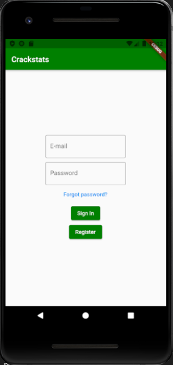
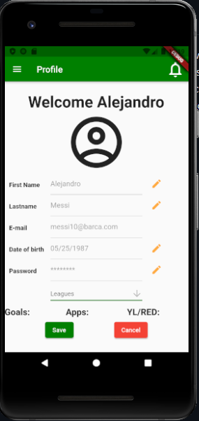

# CrackStats
Repository for CrackStats

## Introduction
The mobile application provides a system to manage soccer leagues. Each player, team owner or league owner needs to create a profile, which includes a password that is encrypted by the system. The profile will have stored the user information, stats, teams, leagues and administrative permissions. The system is self-sustainable, each player requests permission to be added to the team, which is accepted/rejected by the team owner and in the same manner, each time a team wants to be created, it requests permission to a league to be added to it. Leagues are created by application admins. All the information (stats, schedule, team, players, data, etc) is stored in a database. 

  
 

  

## Technologies
### Languages
-Dart 
-Php 
### Frameworks
-Flutter 
### Libraries
-dart:convert  
-flutter/material.dart 
-crypto/crypto.dart 
-collection/collection.dart 
-http/http.dart 
-mailer/mailer.dart 
-mailer/smtp_server.dart 

## Prerequisites
The following software is needed to install and run the system: 
		-Python 2.7 or higher 
		
The following hardware is needed to install and run the system: 
		-Two PCs running in a same network 
 
